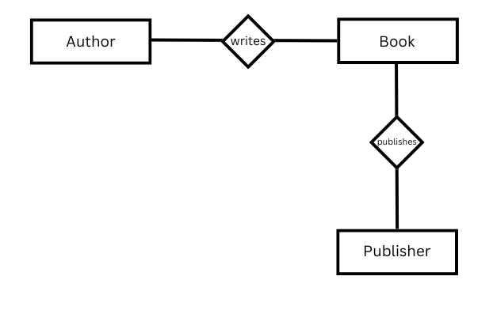

::: questions 

- What is a metadata standard?
- What is a metadata schema? 

:::

::: objectives

- Knowledge of the terms metadata standard and metadata schema. 
- Familiar with the basic ideas of standards and schemas.
- Familiar with the basic concepts and data relationships for standards and schemas.  
:::

## Introduction

The terms *metadata standard*, *metadata schema*, and *metadata model* are often used synonymously. 
The following is an attempt to differentiate between the terms *metadata standard* and *metadata schema*. 
The term *model* can be used synonymously with *schema*. However, it must be emphasized that this is not a universal claim; 
rather, it is intended to facilitate a better understanding of the structures of data standardization, as there are no universally accepted definitions of these terms.

A metadata standard is defined by its function, which is to describe how data should be annotated. 
Each element or data field is uniquely named (e.g., author, title, etc.), specified by rules in the form of attributes (e.g., data type), 
and placed within a selected structure. This provides a basic description and organization of the data, thus standardizing it.

The term *metadata schema* is mostly used for structuring data within a specific context, and there are countless standards for every discipline or specific purpose. 
During the development stage, an existing metadata standard can be integrated. Its rules then apply to the metadata fields, which are in turn placed within a larger context. 
For example, the data field standard for a person can be defined, according to extended rules, as an architect for a building or as a photographer for a photograph. 
With this classification, the photography of a building can be described more precisely: the photographer Lisa Miller photographed the Eiffel Tower of the architect Gustav Eiffel.
The application of these rules is consistent across all individuals in the data set, with their classification occurring within the context of their respective functions or roles.
Consequently, a schema positions the data within a desired context, thereby establishing the relationships between the data.

In this context, the term "conceptual model" is frequently employed. Conceptual models, also referred to as semantic data models, 
are typically abstractions of real-world entities. They are utilized to formally articulate the data of a collection or a specialized domain 
in an abstract manner. An exemplar of such a model is the entity-relationship model, which delineates the relationship between two data entities. 
To illustrate, the relationship between the entity of the author "Franz Kafka" and the entity of the book "The Process" is defined by the relationship "has written". 
This relationship has the advantage of enabling flexible interlinking of data. Additionally, the entity of the book can be linked to the entity of the publisher 
by the relationship "has published". 

The data is modeled in the form of so-called triples. A triple consists of a subject, an object, and a predicate. 
The predicate describes the relationship between the subject and the object: author (subject) has written (predicate) book (object). 
An object can become the subject for another triple, and vice versa, as the above example illustrates. 

This approach is predominantly utilized in the domain of the semantic web, serving as the foundational framework for linked open data, 
which aims to achieve the maximum degree of interconnection among data records. The entities in this context are equipped with unique identifiers in the metadata, 
which in turn represent entities that possess their own metadata. To illustrate, an entity can be delineated by its identifier in the context of the 
Wikimedia Foundation's knowledge base, known as "Wikidata." By establishing these links, the data available in this repository is utilized indirectly.

::: challenge

### Exercise: 

Discuss the following graphic in small groups. What is shown? 

::: solution

### Show me the solution
Not only the name of the author entity, but also its identifier of the GND database is included. 
The Gemeinsame Normdatei, maintained by the German National Library, is a comprehensive database that describes persons, corporate bodies, conferences, geographies, 
subject headings, and works. Within the GND, the author entity is also a metadata entity, containing biographical data. Linking these two entities consolidates their 
data into a single record, eliminating the need for separate recording. The publication also has a data record in the GND, and this entity is linked to all the metadata 
associated with the publication, such as the year of publication.In this example, the publisher has a separate entity in the form of a "Wikidata" record to which it is linked.
The metadata in this entity contains information about the publisher's location, which is linked to an identifier.In this example, it is the TGN ID. 
The Getty Thesaurus of Geographic Names (TGN) serves as a standards database for geographic names, recording various spellings, including historical ones, 
as well as coordinates and country affiliation, among other attributes. This creates a network of data that can be expanded as required, depending on the availability of data.
:::
:::

::: challenge 

### Data Value Standards

These standards provide controlled vocabularies, thesauri (hierarchical lists of related terms), and authority files (lists of standardized names or terms for entities such as authors, artists, or organizations) to ensure consistency in the terms used for describing resources (e.g., Getty Art & Architecture Thesaurus, Virtual International Authority File – VIAF).  
Value standards are vital for enhancing discoverability and ensuring that metadata entries are consistent and accurate across different datasets and systems.
:::

Collections of cultural heritage objects are frequently characterized by significant heterogeneity in terms of their content, age, retro-digitization methods, and associated data acquisition processes. The nature and extent of the recorded metadata also exhibit considerable variation across collections. Variations in data acquisition and storage practices further contribute to the heterogeneity observed. However, the objective of consolidating collections into online portals for enhanced visibility and accessibility necessitates the implementation of data standardization to a maximum extent feasible.

Standardization is necessary from a technical point of view in order to import data into corresponding portals. It also helps research to ensure comparability across large quantities of objects. However, standardizing large amounts of data from a wide variety of collections is costly in terms of time, money, and human resources, which are often in short supply. For this reason, minimum requirements for metadata have been discussed in recent years. A minimum data set developed in Germany will be briefly presented here. 

 
